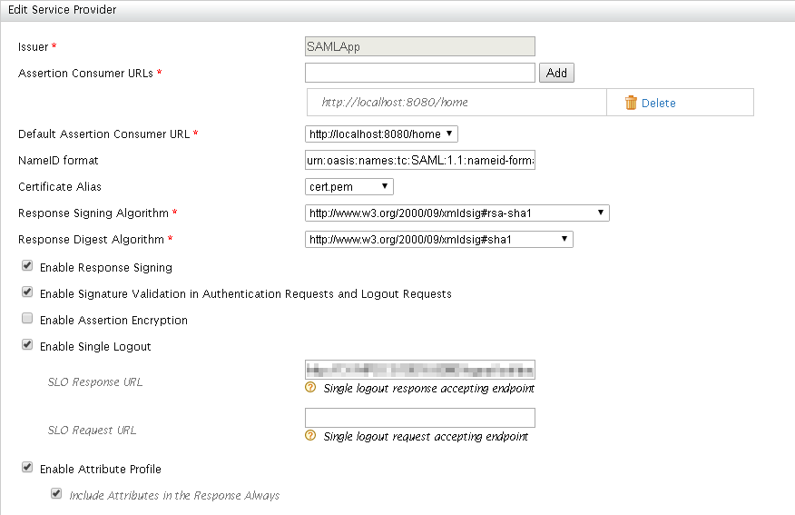
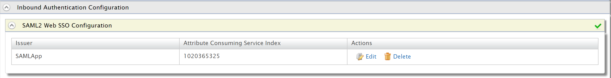

# NodeJS SAML App
SAML app for testing WSO2's SSO flow, created with NodeJS

## Setup
Certain files are <b>required</b> and need to be placed under the ```cert``` directory:
<br />
<br />

#### Generating a ```p12```
First convert the ```jks``` into a ```p12``` using the following command:
```
keytool -importkeystore -srckeystore wso2carbon.jks -destkeystore wso2carbon.p12 -deststoretype PKCS12 -srcalias wso2carbon -deststorepass wso2carbon -destkeypass wso2carbon
```

<br />

#### Generating ```cert/wso2/openssl-certwso2.pem```:
```
openssl pkcs12 -in wso2carbon.p12  -nokeys -out openssl-certwso2.pem
``` 

<br />

#### Generating ```cert/wso2/private-key.pem```:
```
openssl pkcs12 -in wso2carbon.p12  -nodes -nocerts -out private-key.pem
```

## WSO2
Used as an IDP

### SP Config:


### ACS Index:
When setting up the app, make sure to add the Attribute Consuming Index from the setup page to

the Passport config file: ```config/passport.js``` under the ```ACS_INDEX``` key
```
ACS_INDEX: 1020365325
```